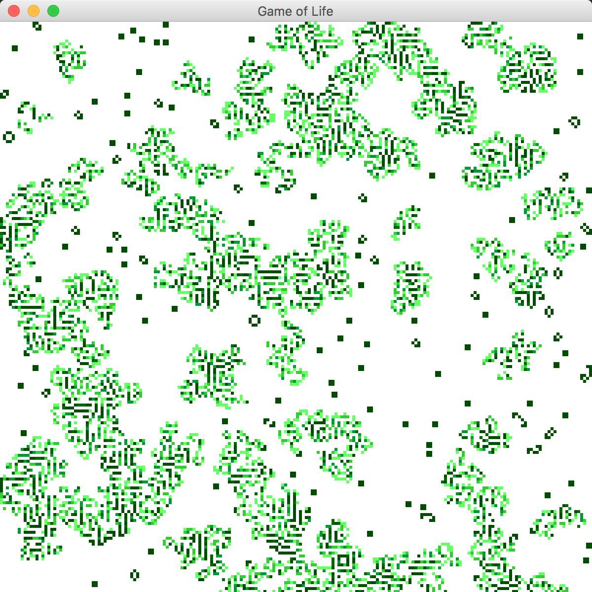

Conway's Game of Life -- Now with Actors!

Many will be familiar with the traditional Conway's Game of Life simulation:
https://en.wikipedia.org/wiki/Conway%27s_Game_of_Life

Conway modeled a generational system of organisms that proliferate and die off
based on how crowded they are by their neighbors. This simulation is often used
as an introductory aid to programming, and has spawned many variants.

The traditional model employs a synchronous recalculation of the entire world
between generations every tick. This implementation differs in that each "cell"
is represented as an `Akka` actor, running independently and concurrently. Rather
than recalculating the world at regular interval, each "cell" listens for signals
from its neighbors and reproduces on its own random schedule.

The result is tremendously different from the traditional, synchronized, deterministic
model. Conway's model often reaches steady states of repeating migrations, or fizzles
out entirely after enough generations. The current implementation has a very different
outcome -- even a very sparse starting population eventually fills the board, moving
in a manner that looks much more organic and colonial in nature. Small pockets expand
slowly outward and merge in a semi-ordered fashion.

You can run the code with `sbt run` from the root project directory.

Please note that this is a proof of concept / exploratory project by a Scala/Akka
newbie with no pretension of expertise on the technical subject matter. This is not
"good" code :-)